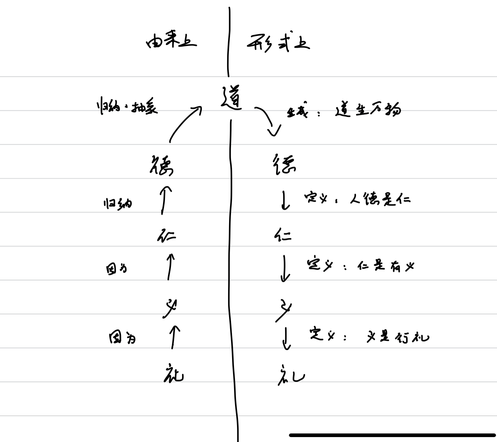

# 无知者的自我记录 后形而上学 其一

鉴于本篇的特殊性质，首先在这里附上《无知者的自我记录 其一》的开篇

> 我原来尝试写过本类似的书，即ETII，想要谈一谈我的想法，然而终究还是过于肤浅。虽然我期望能有所系统的总结，但是事实上我目前所需要的主要是记录。

> 简而言之，我没有受到过任何规范的哲学教育，在这里仅仅是对我的思想作出一部分记录。

以及《ETII》的开篇

> 我不是很清楚什么是理想主义者，我之所以这么说只是因为我周围有人认为我的一些想法是理想主义的。我没有正经的学过哲学，没有经历过任何正统的哲学教育。我缺乏历史常识，对几乎所有的人文学科一无所知，我大概可能会在接下来几年尝试补一补这部分的缺憾，但是我不对我的上进心有任何信心。我没有看过多少书，事实上，我可以说，我基本没有看过任何书。我所有想法的开端，或者说，可以说是开端源于我初中时偶然接触到了“形而上学”这个词语，以及当时天真的我对所谓“真理”的“追求”。然而我是一个不学无术而又怠于阅读的人，遗憾的是，在高中三年当中，我想了很多，但是没有看完过哪怕一本书。我几乎每一天都在计划读点什么，但是从来没有成功过。

> 即便我没有任何见闻和智慧，但是我的思想在高中三年就基本定形了。我是一个愚昧而懒惰的人，但是我对我的想法有着莫名的自信，这大概是因为缺乏见闻的缘故。简而言之，这都不是什么好事。

## 前形而上学

_前形而上学_[^1]，或者我也把它叫做传统形而上学，经典形而上学，是我创造出来的一个名词。所谓前，指的是相对于虚无主义而言的前，即在虚无主义之前的形而上学。

我们将我们在当前所“拥有”的一切叫做_现象_。而在_现象_上，我们推断出一系列_现象_的运行方式/规律。所谓“现象的运行方式/规律”，既是前形而上学[^2]。

前形而上学有一个**形式上的**错误理解，既是对“_上_”的理解。形而上学的英文，“_metaphysics_”，字面上来看，既是_元物理_。倘若把物理理解为_现象_，那么形而上学所描述的，既是产生现象的原因。然而事实上，请看上一段对形而上学的解释，形而上学事实上是**自现象而产生的**。所谓“上”，应当是我们**基于现象之上**而有的一套理解，而非自上而下由形而上**生成**了形。因此，_现象_，亦或者说我们所感受到的世界，对于我们而言，并非_生成的世界_，而是对于我们而言的“_第一实在_”。我们任何的对于现象的理解，都**基于**现象。唯有承认现象既是“_第一实在_”，我们才能够作出任何形而上的推断。

请看如下例子：

> 故失_道_而后_德_，失_德_而后_仁_，失_仁_而后_义_，失_义_而后_礼_。——老子

其中，_道_，_德_，_仁_，_义_，_礼_，自前往后，既是从上至下。_道_生万物，_道_既是最“元始”的_元物理_（_metaphysics_），而有此往后，皆是_生成_的。因此，道既是最上者，是为形而上，而礼既是最下者，是为形。

然而，礼事实上是从现象所总结出来的，我们不妨将这个**切实**的_现象_中的行为称之为“_现象礼_”，我对“_现象礼_”有一个**解释**，既是我对人时发乎于心的对他人感受，这个感受是我个人**切实**感受到的，因而是_现象_的一部分，因此我将其称之为“_现象仁_”。这个感受使得我想要去如何如何地对待他人，这种推动力（motivation）也是我所**切实**感受到的，因此我将其称之为“_现象义_”[^3]。“_现象礼_”不仅仅存在于在我对待他人时，也同样存在于其他人是如何对待他人上，我们便将“_现象仁_”和“_现象义_”作为我们对“_现象礼_”的**解释**推而广之。也就是说，因为“_现象礼_”（似乎）在我们周围的所有人身上都有体现，而我们认为（将“_现象礼_”解释为）“_现象仁_”产生了“_现象义_”又产生了”_现象礼_”，所以我们认为所有（行“现象礼”的）人都（应当）有这种“_现象仁_”[^4]。接下来，我们便把我们认为（应当是）人人皆而有之的东西，在这里便是“_现象仁_”，称之为“_德_”，而为什么会有这种人人皆而有之的**规律**呢？因为“_道_”。

因此我们看到，在现象的层面上，_仁义_仅仅是对于_礼_的一个解释。对于我们看到的外在的_现象_而言，事实上我们仅仅看到了_现象_中的“_现象礼_”，因而我们**推断**出了“_现象义_”，续而由“_现象义_”**推断**出了“_现象仁_”，即便并**没有**任何**切实**的“_现象义_”和“_现象仁_”出现在我的_现象_中，因为**我**所感受到的发乎于心的感受和推动力仅仅是**我**在行“_现象礼_”时所感受到的，而我无法真正感受到**他人**的内心感受，仅仅是将我对“**自己**的‘_现象礼_’”的解释**套用**到了我们看到的**别人**所行的“_现象礼_”上。因此，别人身上的_仁义_，其实是由_现象_中的“_现象礼_”所生成的。但是我们在解释上却认为是由_仁_而生_义_，因_义_而行_礼_，“_现象礼_”反而是由_仁义_所生成的了。接下来，基于这种生成的_仁义_，我们便总结出来，“人都是有_仁_的”。但是，事实上是“人都是（**可以**）有_仁_的”，因为我们是从诸多有_仁_的人身上发现许多人都是有_仁_的，因此_仁_是我们归纳出来的一个**属性**（**property**）。但是我们最终对其的理解是“人都是（**应该**）有_仁_的”——或者说，“有_仁_的才是人”。因此人可以拥有的一个**属性**，在这里既是“_仁_”，反而变成了人的一个**定义**。而这些**定义**合起来，便定义了**什么是_人_**——也就是“_德_”，使得_人_而成为_人_的东西。因此我们看到，事实上“_德_”也是由“_仁_”生成的，但是我们在理解上却认为，是因“_德_”而生“_仁_”：因为你是_人_，所以你要有_仁_。最后，“_德_”是一种一般的规律，因为凡事诸物皆有其_德_（我们认为他应该遵守的规律，使得一样东西成为其本身的东西），因而又将所有的“_德_”合起来，归纳抽象出“_道_”，因此“_道_”实则为“_德_”而生成的，我们却理解为“_道_”生成了“_德_”。

因此，整个逻辑的顺序就被倒反过来。道生德，人德为仁，因仁生义，因义行礼。而这最后的“_礼_”已经不再是一开始的“_现象礼_”，因为从“_现象礼_”生成“_道_”的逻辑已经被**掩埋不见**，已经全部**失**去了，人们以为“_道_”才是最元始的_元物理_。因此最终生成的“_礼_”已然仅仅是一种规范，而不一定是最初的（解释上）发乎于心的而有的_现象礼_了。

---- 

在实践中，这种失将继续层层下跌，逐末而忘本。单纯的执着于礼而内心毫无仁义，单纯的有着自己的仁义之心却忽略他人，因此才会说“夫礼者，忠信之泊也，而乱之首也”吧。上述并非对《老子》的解释，而是在这一段当中，恰好出现了这种自形而上至形的阶梯，因此将此作为一个例子。

### 形而上

在上述的例子中，我用了中国哲学举例。然而，中国哲学是有_形而上_而无_形而上学_的。所谓形而上学，既是研究形而上的学科和学问，是对形而上的学习和分析。在西方，形而上学追求的是_终极实在_，既是最终的，最原始的_元物理_——_根源_之所在。而在中国，大多数时候，我们在一个给定好的_形而上_的框架中抵达这个框架中的_至善_，追求的是_圣人_，因而一是皆以_修身_为_本_。对于_形而上_的探索（也就是_形而上学_）因而相较西方要少了许多。因此，一定要区分_形而上_和_形而上学_的区别。_形而上_是我们对现象的一种**理解**、**解释**。而_形而上学_是对形而上的**研究**。

在这里我将形而上分为如下几种：

#### _第〇种_：经验的总结

形而上学的核心是_**恒常**_。我们需要在变化的现象之中寻找到（追求）一种_恒常_性，因此我们才能够有意作出任何有（对于我们而言的）结果的行为。有人将形而上学的基础总结为_同一_，_因果_。然而，_因果_即为时间上的_同一_，因此其本质上是一回事。我在这里将其称之为_恒常_。_恒常_的意义是一种（我们给自己的）“**保证**”。这个**保证**既是：同样的_现象_（_实在_）将会**重复**的出现。

也就是说，我们首先认为，我们眼前的一个苹果（的图像），在下一刻，他和这一刻，是**同一个**_东西_——既是_恒常_。
我们看着这个苹果（的图像）在我们的视野中变化位置，缩放，甚至旋转（旋转改变了他的图像，因而递进），我们却依旧认为这是**同一个**_东西_——既是_恒常_。

我们根据我们**眼前的**这个**具体的**[^5]苹果的图像，构建了一个（具体的）“_东西_”，也就是这一个**具体**的（我们认为是）“客观存在的”苹果，这个（具体的）“_东西_”，相对于变化的_现象_，既是_恒常_。
注意到，这个“_东西_”实则我们对我们**眼前的**苹果图像的**解释**——他是由现象中的苹果图像所_生成_的。我们把这个“_东西_”叫做“_第二实在_”。

我们看到了数个不同的具体的苹果，我们从他们的相似之处中_抽象_出了一个“苹果”的概念。这也是_恒常_。这个“_理想的‘苹果’_”，或者说，这个“_形而上的苹果_”，是我们对具体的苹果的_归纳_（_抽象_）[^6]。

我们把这两种恒常叫做_第〇种形而上_。

#### _第一种_：经验的预测

_第一种形而上_必须要基于_第〇种形而上_。他是基于_第〇种形而上_之上的_恒常_：总是发生的事情（大概率）会（在未来）**重复**发生[^7]。

例一：我看到了**很多次**苹果树上结苹果，苹果变大了掉下来。所以我认为苹果树**以后**也会**重复**地结苹果，他结的苹果**以后**也会**重复**地掉下来——是为_恒常_。

例二：李四**每次**用我的东西都会送回来，张三**每次**用我的东西都大多自己拿走了。所以我认为，**以后**李四用我的东西也**都**会送回来，张三**以后**用我的东西也**都**大多自己拿走了——是为_恒常_。

#### _第二种_：经验的抽象

我们将第一种形而上_归纳_，_抽象_为一种概念，例如“_诚信_”——是为_恒常_。

我们注意到，_第〇、一、二种形而上_，都是同样的两步过程：对**重复**事物的认知（这种认知是_恒常_的，因其认知正在于其**重复**）[^8]，然后将这种认知抽象理解，**固定**为一个（_形而上_）_概念_（这个_概念_是_恒常_的，因其已经**脱离**_现象_而恒在）[^9]。第一步既是_第一种形而上_，第二步既是_第二种形而上_。

所谓_第〇种_，其实只是_第一种_（步）和_第二种_（步）最简单（trivial）和基础（fundamental）的形式。第〇种更强调的是其原材料**全部**来自于_现象_ [^10]，而_第一二种_中，其原材料除了来自于_现象_，也来自于已有的_概念_（_形而上_）[^11]。

注意到，这种“_归纳_”，是**合**，也是**分**。他界定了什么是**同一个**东西/概念——于是也界定了哪些**不是同一种**东西/概念。

#### _第三种_：抽象的组合

_第三种形而上_，便是对_第二种形而上_的理解。他**连接**不同的_形而上_，又自_形而上_而产生_形而上_——也就是说，他是对已有_形而上_的一种**形式化**，因此他可能是一种**框架**、一种**价值**。

---- 

注意到，我们提到了两种形而上的“理解”。第一种是自下而上的，例如形式为_归纳_的理解：我们看到了高楼林立，因此我们把高楼林立的地方归纳为城市。另一方面，则是自上而下的，形式为_定义_的理解：我们认为城市**应当**是高楼林立的。甚至我们可以通过再其上的形而上（_第三种_），重新定义城市，再要求具体的城市具有哪些功能和特征。这也是自上而下的。有了实践作为桥梁，自下而上将会影响到自上而下，而自上而下也会影响到自下而上。因而最终上述几种形而上会夹杂在一起[^12]。

### 附录：关于本篇中“形而上”一词的一点说明

“形而上学”一词，乃是自英文“metaphysics”翻译而来。其中，“形而上”，取自《易经系辞传》第八章第五节：

> 是故形而上者谓之道，形而下者谓之器，化而裁之谓之变，推而行之谓之通，举而措之天下之民，谓之事业。

在本片文章中，对将形解为“现象”。现象是一切的基础，因而是最下者。因此这种解释有异于系辞传中“形”的本意。如果要一一对应，还是以苹果为例子，那么系辞传中的形对应于本篇中的“理想中的‘苹果’”，器对应于对应于_第二实在_的苹果。

### 附录：客观世界

_客观世界_是**基于**_现象_而提出的一种**模型**。按照本篇中的定义，所谓“_客观世界_”，既是由_第二实在_所构成的“世界”。即是说，我们认识中的_客观世界_，是以_现象_，既_第一实在_，为**基础**，所**生成**的对_现象_其本身的**解释**。在这个解释之中，**形式上**是由_客观世界_生成了被我们所观测到的世界，也就是_现象_。

**形式上**，倘若一开始没有任何东西，那么**先**存在一个**真正的**_客观世界_，和**先**存在_现象_，有着巨大的区别（也没有任何区别）。当我们说“**先**存在一个**真正的**_客观世界_”时，_现象_是生成的，然后自生成的现象上，生成了**认识中的**_客观世界_（而**不**是**真正的**_客观世界_）[^13]。当我们说，“**先**存在_现_象”时，就**不**存在**真正的**_客观世界_，只存在“**真正的** ”_现象_。我们自_现象_上生成了**认识中的**_客观世界_。

然而，我们毫无选择地必然要从_现象_**起始**，因此_现象_本身是无可怀疑（因为怀疑_现象_就无任何可立足之**地**，任何_形而上_都自_现象_而来）的存在，所以被称之为“_第一实在_”。而我们进发的方向必然是向着二（上）而无法向着〇（下[^14]）。我们之所以要提出_第〇实在_，是为了给现象以**解释**和**理解**，因而我们提出的正是对_第一是在_的_形而上_，既是_第二实在_。于是对于我们而言，并不存在_第〇实在_，而只存在_第二实在_。当我们提出_第〇实在_时，这个我们所提出的东西就是_第二实在_[^15]。

---- 

请看如下例子：

一个简单的情形，假设我们

（未完成……需修改）

### 附录：内外之分

此处概括一部分《无知者的自我记录 自我认知 其一》中的一部分。

本篇中，我将现象定义为

> 我们将我们在当前所“拥有”的一切叫做_现象_。

因而，现象既包括我们在传统认知上外在的视觉，听觉，触觉等的结果，也包括我们在传统认知上我们自己内心和对我们身体的感受。然而，我们在理解上却有一种对内外的区分——既_我_的疆界。《无知者的自我记录 自我认知 其一》便是讨论_我_的疆界的一篇文章。

在这条区分内外的线上，主要两样东西沟通了内外。其一为_感受_，其二为_行为_[^16]。这两者都包括_主动_的和_被动_[^17]的，但是在一般理解中，感受多被动，而行为多主动。

在传统理解上，_现象_（以后称之为_经典现象_）指的是其中_外_的部分，而_我_指的是其中_内_的部分。

（未完成……需修改）

### 附录：分

形而上来自于现象中的一部分的归纳抽象，这种这种归纳是一种合，但是他同时也界定了不合，因而形而上也是一种分。在表达上，这种分最终基于语言而“固定”[^18]下来。

（未完成……需修改）

## 前形而上学之后

一般认为，形而上学的末路是_虚无主义_。

在我看来，形而上学的发展有其脉络。其脉络既是对于终极实在的层层回避，步步后退，而向着实用性逐渐靠近的过程。因为愈探求，愈不可探求，因为“事实上并不存在这样的终极实在”。随着“最高价值”（既“终极实在”）的丧失，形而上学的大厦自然地倒塌，留下的遗迹被称之为虚无主义。虚无主义不是一种有、一种主义，而是一种无，一种缺位。虚无主义不是被生产、创造出来的，正如虚空并不是被生产创造出来的，而是因为没有生产和创造了，这里什么都没有而已。

但是虚无主义中的大部分议题实际上是**非理性**的。

### 非理性

关于理性的具体论述，请参照《无知者的自我记录 自我认知 其一》。在这里要展示的结论是：因为，显然的，理性的目的必然要在理性之外，所以，理性的目的必然是非理性的——也就是说，理性仅仅作为一种工具而存在。

因此我们自然的知道，**对_终极实在_的追求本身就是非理性的**（形而上学本身就是非理性的）。因此，虚无主义之所以能够被提出来（虚无主义之所以是虚无**主义**、之所以使得“没有终极实在”成为一种议题）的原因也是**非理性**的。

同样的，我们对_形而上_的**追求**同样是非理性的。因为倘若不存在任何的形而上，那么我们面对现象就没有任何“抓手”——我们就无法（对于我们而言）有意义的作出任何行为[^19]。也就是说，我们（看似理性的）对_形而上_的**追求**其实就是我们**非理性**的对_恒常性_的追求。

我认为，这种**非理性**是应当被**承认**的[^20]。也就是说，

### 作为方式、方法的逻辑（理性）

### 重整化

## 后形而上学

后形而上学，必然是虚无主义之后才可以产生的形而上学。以我所见，所谓后形而上学，既是以现象为核心，承认所有形而上皆为现象之上的构造的形而上学。因此，其必须时时刻刻认识到，任何的形而上仅仅是对形的描述和建模——因此其方法论的核心必然要和现象紧密的联系在一起。人何以同现象交互？既是通过感受和行为。最常见的方法，既是实践与实验。

（未完成……需修改）

### 实践与实验

### 科学

### 以静止片面的观念看待问题/以变化发展的眼光看问题

#### 例子：大媒体与小媒体

### 数据，知识，反应，行为与抽象——论学习

[^1]:	在本篇文章中，以_这样_的文字作为特指、特定的名称、引用的名称，以**这样**的文字作为强调，以这样的文字作为句子中给出的可以当作定义的段落。

[^2]:	这里是想要给出一个传统上的定义。

[^3]:	仁义礼实则是已经是一套形而上的框架了。而我们又不得不借助一些框架来描述现象，因而即便我极力尝试还原其作为现象的本来面貌，但是其仍旧是失准的。中国哲学常将仁义并提。所谓仁，是谓爱人。所谓义，是谓应当。按照形式上的理解，以爱父亲这一仁来举例。我爱我的父亲所应当做的，就是义。而这个义的具体行为，则是礼。因而义是连接仁和具体行为（礼）的那个东西。在现象上，我这里用现象仁来描述我内心对我父亲的某种（爱的）感受，这个感受使得（推动）我去做一些行为。那么这种推动力，这种“motivation”本身，就是连接我的这种感受（现象仁）和我的这种行为（现象礼）的东西，因而把它叫做现象义是合适的。

[^4]:	这种推而广之的别人身上的“现象仁”和“现象义”已经不在我的现象之中了。

[^5]:	而不是其他的任何一个具体的苹果。

[^6]:	在本篇文章中，归纳和抽象似乎常常混用，因而在此作出一些解释。抽象和抽象都可以理解为从材料中略去部分特定的细节，选中某些选定的共性，而生成一个概念（形而上）的过程。但是其强调的方面有所不同。归纳强调归类（选定共性），而抽象强调生成（生成形而上）。

[^7]:	这里的恒常和第〇种中介绍的恒常没有区别。

[^8]:	我认识到李四**总是**会把我的东西送回来。

[^9]:	假设明天世界上所有诚信的人都死了，人们心中关于诚信的概念依然存在。

[^10]:	此处意为“原始的现象”。在我们形成形而上的概念之后，我们脑海中的概念也成为了现象的一部分。请参见《无知者的自我记录 自我认知 其一》。本篇中的所述_现象_皆是指的原始的现象，以符合人们对现象的传统理解。

[^11]:	也就说，第一二中的材料是非原始的现象，而第〇种的材料是原始的现象。

[^12]:	这里的夹杂有两重意义。第一重既是自上而下和自下而上的夹杂，正如上述对城市的双重理解。第二重既是第一、二、三种和第〇种的夹杂，正如按照对城市的理想（第一、二、三种形而上）而建设后产生的具体的城市，也是（原始的，见上注）现象，因而影响到第〇种形而上。

[^13]:	而**认识中的**_客观世界_也并不是对**真正的**_客观世界_的拟合，而是对_现象_的拟合（以期望达成对**真正的**_客观世界_的拟合）。

[^14]:	因为对于我们而言现象已经是最下者。

[^15]:	这个逻辑和先前讨论的_道_是相同的。在形式上，是_道_生万物，然而事实上，_道_才是被生成的。因此，**形式上**，倘若真的有真正的_道_，既_第〇实在_（或者更下），当他被提出就成为了_第二实在_（或者更上），因而真正的_道_不可道不可名，无可讨论无法提出。

[^16]:	这两者的定义，以及区分内外的界限的具体讨论详见《无知者的自我记录 自我认知 其一》。在此没有给出具体定义因此有模糊性，但不妨碍其后的讨论。

[^17]:	主动指的在理解上自内而外，由内发出，“最终”原因在内的。被动指的自外而内，由外发出，内部对其无所控制力，“最终”原因在外的。

[^18]:	这种固定其实是不稳固的

[^19]:	假设**我**是有（理性和非理性的）目的性的。那么如果我**完全**不知道做一件事情的后果，那么做不做这件事情**对我而言**就没有区别。就像是拿手指在波涛汹涌的海洋（现象）中随手搅拌一样。

[^20]:	这种承认是出于一种目的而承认的。